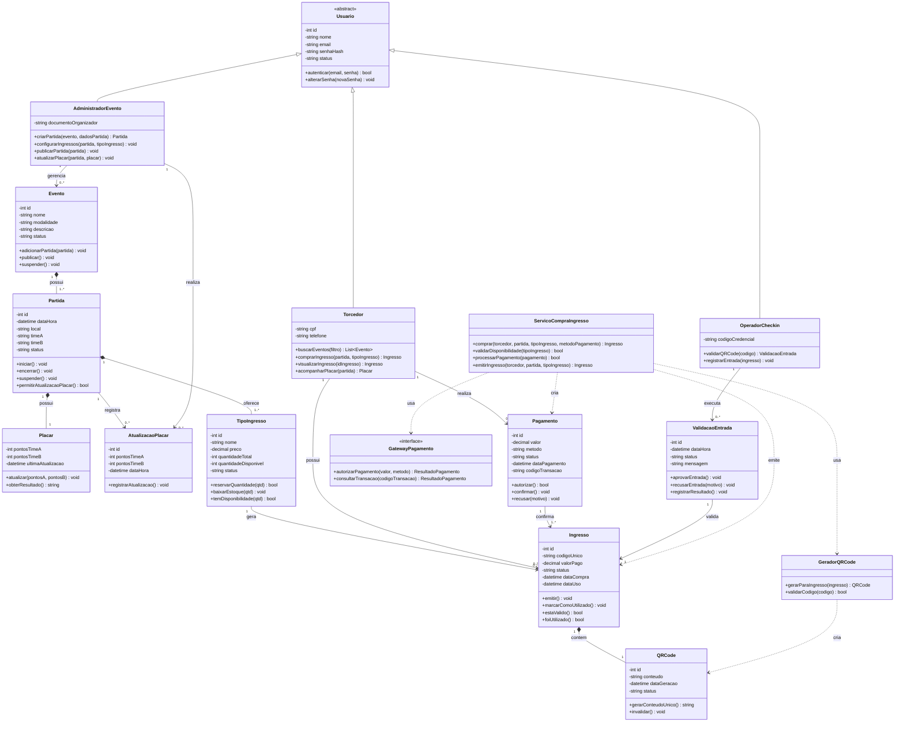

# 01 — Diagrama de Classes

## 1. Diagrama de Classes

Este diagrama de classes representa as principais classes envolvidas nas três fatias verticais selecionadas para a plataforma **ArenaStream**:

1. **Compra de ingresso online com geração de QR Code**;
2. **Atualização e exibição do placar ao vivo**;
3. **Validação de ingresso no check-in com bloqueio de reutilização**.

O objetivo não é modelar todo o sistema, mas representar as classes essenciais para os fluxos escolhidos, incluindo seus atributos, métodos, responsabilidades e relacionamentos.

---

## 1.1 Classes principais identificadas

As classes foram organizadas a partir das responsabilidades observadas nas fatias selecionadas.

| Classe | Responsabilidade principal | Fatia relacionada |
|---|---|---|
| `Usuario` | Representar dados comuns dos usuários do sistema | Fatias 1, 2 e 3 |
| `Torcedor` | Comprar ingressos, acessar QR Code e acompanhar placar | Fatias 1, 2 e 3 |
| `AdministradorEvento` | Gerenciar eventos, partidas e placares | Fatia 2 |
| `OperadorCheckin` | Validar ingressos no acesso ao evento | Fatia 3 |
| `Evento` | Agrupar partidas esportivas | Fatias 1 e 2 |
| `Partida` | Representar uma partida esportiva e seu estado | Fatias 1, 2 e 3 |
| `Placar` | Armazenar e atualizar o placar da partida | Fatia 2 |
| `AtualizacaoPlacar` | Registrar histórico de alterações do placar | Fatia 2 |
| `TipoIngresso` | Definir categoria, preço e quantidade de ingressos | Fatia 1 |
| `Ingresso` | Representar ingresso comprado pelo torcedor | Fatias 1 e 3 |
| `QRCode` | Representar o código digital vinculado ao ingresso | Fatias 1 e 3 |
| `Pagamento` | Controlar dados da transação de compra | Fatia 1 |
| `GatewayPagamento` | Interface para integração com serviço externo de pagamento | Fatia 1 |
| `ServicoCompraIngresso` | Coordenar o fluxo de compra, pagamento e emissão do ingresso | Fatia 1 |
| `GeradorQRCode` | Gerar códigos únicos para ingressos digitais | Fatia 1 |
| `ValidacaoEntrada` | Registrar a validação do ingresso no check-in | Fatia 3 |

---

## 1.2 Diagrama de Classes em Mermaid



---

## 1.3 Justificativa das principais decisões de modelagem

### Uso da classe abstrata `Usuario`

A classe `Usuario` foi definida como abstrata porque existem dados e comportamentos comuns aos diferentes tipos de usuários da plataforma, como `id`, `nome`, `email`, `senhaHash` e métodos de autenticação. Porém, cada perfil possui responsabilidades diferentes.

Assim, `Torcedor`, `AdministradorEvento` e `OperadorCheckin` herdam de `Usuario`, evitando repetição e deixando claro que esses perfis compartilham características comuns, mas executam ações específicas dentro do sistema.

---

### Uso da interface `GatewayPagamento`

A interface `GatewayPagamento` representa a dependência externa com serviços de pagamento. Essa decisão evita que o sistema fique acoplado a um provedor específico, como Mercado Pago, Stripe ou PagSeguro.

Com essa modelagem, a classe `ServicoCompraIngresso` depende de uma abstração. Isso facilita a substituição futura do gateway e permite testes com simulações de pagamento aprovado, recusado ou indisponível.

---

### Criação da classe `ServicoCompraIngresso`

A classe `ServicoCompraIngresso` foi criada para coordenar o fluxo de compra do ingresso, pois esse processo envolve várias etapas:

1. verificar disponibilidade do tipo de ingresso;
2. criar ou processar o pagamento;
3. confirmar a transação;
4. emitir o ingresso;
5. gerar o QR Code.

Essa classe evita que responsabilidades de coordenação fiquem concentradas em entidades como `Torcedor`, `Pagamento` ou `Ingresso`.

---

### Composição entre `Evento` e `Partida`

Foi utilizada composição entre `Evento` e `Partida`, pois, no contexto da ArenaStream, uma partida é cadastrada dentro de um evento esportivo. Se o evento for removido do sistema, suas partidas relacionadas também deixam de fazer sentido dentro daquele contexto.

Representação:

```text
Evento 1 *-- 1..* Partida
```

---

### Composição entre `Partida` e `Placar`

A classe `Placar` foi modelada como parte da `Partida`, pois cada partida possui um placar associado. O placar não existe isoladamente sem uma partida.

Representação:

```text
Partida 1 *-- 1 Placar
```

---

### Composição entre `Ingresso` e `QRCode`

O `QRCode` foi modelado como parte do `Ingresso`, pois ele é gerado para representar digitalmente aquele ingresso específico. Cada ingresso deve possuir um QR Code único, utilizado no momento do check-in.

Representação:

```text
Ingresso 1 *-- 1 QRCode
```

---

### Classe `ValidacaoEntrada`

A classe `ValidacaoEntrada` foi criada para registrar o resultado da leitura do QR Code no check-in. Ela permite manter histórico da operação, incluindo horário, status e motivo de recusa quando houver.

Essa classe é importante para a Fatia 3, pois o sistema precisa impedir reutilização de ingresso e registrar quando um ingresso foi validado.

---

## 1.4 Rastreabilidade entre classes e fatias

| Fatia | Classes principais envolvidas |
|---|---|
| Fatia 1 — Compra de ingresso online com geração de QR Code | `Torcedor`, `Partida`, `TipoIngresso`, `Pagamento`, `Ingresso`, `QRCode`, `GatewayPagamento`, `ServicoCompraIngresso`, `GeradorQRCode` |
| Fatia 2 — Atualização e exibição do placar ao vivo | `AdministradorEvento`, `Evento`, `Partida`, `Placar`, `AtualizacaoPlacar`, `Torcedor` |
| Fatia 3 — Validação de ingresso no check-in com bloqueio de reutilização | `OperadorCheckin`, `Ingresso`, `QRCode`, `ValidacaoEntrada`, `Partida`, `Torcedor` |

---

## 1.5 Observações sobre o escopo do diagrama

Algumas funcionalidades existentes no Documento de Requisitos não foram representadas no diagrama de classes porque estão fora das três fatias verticais escolhidas. Entre elas estão:

- autenticação completa de usuários;
- histórico detalhado de eventos;
- notificações de times favoritos;
- transmissão ao vivo;
- relatórios avançados de venda;
- modo de contingência do check-in.

Essas funcionalidades podem ser adicionadas em futuras expansões do modelo, mas não fazem parte do recorte atual.