# 02 — Modelo Entidade-Relacionamento (MER)

## 2. Modelo Entidade-Relacionamento

Este documento apresenta o **Modelo Entidade-Relacionamento (MER)** da plataforma **ArenaStream**, considerando apenas as entidades persistentes relacionadas às três fatias verticais selecionadas:

1. **Compra de ingresso online com geração de QR Code**;
2. **Atualização e exibição do placar ao vivo**;
3. **Validação de ingresso no check-in com bloqueio de reutilização**.

O objetivo deste MER não é representar todo o banco de dados da plataforma, mas somente as entidades que precisam ter seus dados armazenados de forma permanente para atender aos fluxos escolhidos.

---

## 2.1 Entidades Persistentes Identificadas

A partir do diagrama de classes, foram selecionadas como persistentes as classes cujos dados precisam sobreviver após a execução do sistema.

| Entidade               | Origem no diagrama de classes | Justificativa                                                       |
| ---------------------- | ----------------------------- | ------------------------------------------------------------------- |
| `usuario`              | `Usuario`                     | Armazena dados básicos de autenticação e identificação dos usuários |
| `torcedor`             | `Torcedor`                    | Armazena dados específicos do torcedor                              |
| `administrador_evento` | `AdministradorEvento`         | Armazena dados específicos do administrador de eventos              |
| `operador_checkin`     | `OperadorCheckin`             | Armazena dados específicos do operador de entrada                   |
| `evento`               | `Evento`                      | Armazena eventos esportivos cadastrados                             |
| `partida`              | `Partida`                     | Armazena partidas vinculadas a eventos                              |
| `placar`               | `Placar`                      | Armazena o estado atual do placar da partida                        |
| `atualizacao_placar`   | `AtualizacaoPlacar`           | Armazena o histórico de mudanças do placar                          |
| `tipo_ingresso`        | `TipoIngresso`                | Armazena categorias, preços e quantidades de ingressos              |
| `pagamento`            | `Pagamento`                   | Armazena dados da transação de pagamento                            |
| `ingresso`             | `Ingresso`                    | Armazena ingressos emitidos para os torcedores                      |
| `qr_code`              | `QRCode`                      | Armazena o código digital associado ao ingresso                     |
| `validacao_entrada`    | `ValidacaoEntrada`            | Armazena tentativas e resultados de validação no check-in           |

As classes `ServicoCompraIngresso`, `GeradorQRCode` e `GatewayPagamento` não aparecem como entidades no MER porque representam serviços, regras de aplicação ou integração externa, e não dados que precisam ser armazenados diretamente como tabelas principais.

---

## 2.2 Diagrama MER em Mermaid

```mermaid
erDiagram

    USUARIO {
        int id_usuario PK
        varchar nome
        varchar email
        varchar senha_hash
        varchar status
        varchar tipo_usuario
        timestamp data_criacao
    }

    TORCEDOR {
        int id_usuario PK, FK
        varchar cpf
        varchar telefone
    }

    ADMINISTRADOR_EVENTO {
        int id_usuario PK, FK
        varchar documento_organizador
    }

    OPERADOR_CHECKIN {
        int id_usuario PK, FK
        varchar codigo_credencial
    }

    EVENTO {
        int id_evento PK
        int id_administrador FK
        varchar nome
        varchar modalidade
        text descricao
        varchar status
        timestamp data_criacao
    }

    PARTIDA {
        int id_partida PK
        int id_evento FK
        timestamp data_hora
        varchar local
        varchar time_a
        varchar time_b
        varchar status
    }

    PLACAR {
        int id_placar PK
        int id_partida FK
        int pontos_time_a
        int pontos_time_b
        timestamp ultima_atualizacao
    }

    ATUALIZACAO_PLACAR {
        int id_atualizacao PK
        int id_partida FK
        int id_administrador FK
        int pontos_time_a
        int pontos_time_b
        timestamp data_hora
    }

    TIPO_INGRESSO {
        int id_tipo_ingresso PK
        int id_partida FK
        varchar nome
        decimal preco
        int quantidade_total
        int quantidade_disponivel
        varchar status
    }

    PAGAMENTO {
        int id_pagamento PK
        int id_torcedor FK
        decimal valor_total
        varchar metodo
        varchar status
        timestamp data_pagamento
        varchar codigo_transacao
    }

    INGRESSO {
        int id_ingresso PK
        int id_tipo_ingresso FK
        int id_torcedor FK
        int id_pagamento FK
        varchar codigo_unico
        decimal valor_pago
        varchar status
        timestamp data_compra
        timestamp data_uso
    }

    QR_CODE {
        int id_qrcode PK
        int id_ingresso FK
        varchar conteudo
        timestamp data_geracao
        varchar status
    }

    VALIDACAO_ENTRADA {
        int id_validacao PK
        int id_ingresso FK
        int id_operador FK
        timestamp data_hora
        varchar status
        varchar mensagem
    }

    USUARIO ||--|| TORCEDOR : especializa
    USUARIO ||--|| ADMINISTRADOR_EVENTO : especializa
    USUARIO ||--|| OPERADOR_CHECKIN : especializa

    ADMINISTRADOR_EVENTO ||--o{ EVENTO : gerencia
    EVENTO ||--|{ PARTIDA : possui
    PARTIDA ||--|| PLACAR : possui
    PARTIDA ||--o{ ATUALIZACAO_PLACAR : registra
    ADMINISTRADOR_EVENTO ||--o{ ATUALIZACAO_PLACAR : realiza

    PARTIDA ||--|{ TIPO_INGRESSO : oferece
    TIPO_INGRESSO ||--o{ INGRESSO : gera
    TORCEDOR ||--o{ PAGAMENTO : realiza
    PAGAMENTO ||--|{ INGRESSO : confirma
    TORCEDOR ||--o{ INGRESSO : possui
    INGRESSO ||--|| QR_CODE : possui

    OPERADOR_CHECKIN ||--o{ VALIDACAO_ENTRADA : executa
    INGRESSO ||--o{ VALIDACAO_ENTRADA : passa_por
```

---

## 2.3 Dicionário de Dados

### 2.3.1 Entidade `usuario`

| Campo          | Tipo         | Chave | Descrição                                            |
| -------------- | ------------ | ----- | ---------------------------------------------------- |
| `id_usuario`   | INT          | PK    | Identificador único do usuário                       |
| `nome`         | VARCHAR(150) |       | Nome completo do usuário                             |
| `email`        | VARCHAR(150) |       | E-mail utilizado para login                          |
| `senha_hash`   | VARCHAR(255) |       | Senha armazenada de forma protegida                  |
| `status`       | VARCHAR(30)  |       | Situação do usuário, como ativo ou bloqueado         |
| `tipo_usuario` | VARCHAR(30)  |       | Tipo do usuário: torcedor, administrador ou operador |
| `data_criacao` | TIMESTAMP    |       | Data de criação do cadastro                          |

---

### 2.3.2 Entidade `torcedor`

| Campo        | Tipo        | Chave | Descrição                  |
| ------------ | ----------- | ----- | -------------------------- |
| `id_usuario` | INT         | PK/FK | Referência ao usuário base |
| `cpf`        | VARCHAR(14) |       | CPF do torcedor            |
| `telefone`   | VARCHAR(20) |       | Telefone de contato        |

---

### 2.3.3 Entidade `administrador_evento`

| Campo                   | Tipo        | Chave | Descrição                                           |
| ----------------------- | ----------- | ----- | --------------------------------------------------- |
| `id_usuario`            | INT         | PK/FK | Referência ao usuário base                          |
| `documento_organizador` | VARCHAR(30) |       | Documento do organizador ou responsável pelo evento |

---

### 2.3.4 Entidade `operador_checkin`

| Campo               | Tipo        | Chave | Descrição                                    |
| ------------------- | ----------- | ----- | -------------------------------------------- |
| `id_usuario`        | INT         | PK/FK | Referência ao usuário base                   |
| `codigo_credencial` | VARCHAR(50) |       | Credencial utilizada pelo operador no evento |

---

### 2.3.5 Entidade `evento`

| Campo              | Tipo         | Chave | Descrição                             |
| ------------------ | ------------ | ----- | ------------------------------------- |
| `id_evento`        | INT          | PK    | Identificador único do evento         |
| `id_administrador` | INT          | FK    | Administrador responsável pelo evento |
| `nome`             | VARCHAR(150) |       | Nome do evento esportivo              |
| `modalidade`       | VARCHAR(80)  |       | Modalidade esportiva do evento        |
| `descricao`        | TEXT         |       | Descrição do evento                   |
| `status`           | VARCHAR(30)  |       | Situação do evento                    |
| `data_criacao`     | TIMESTAMP    |       | Data de cadastro do evento            |

---

### 2.3.6 Entidade `partida`

| Campo        | Tipo         | Chave | Descrição                                                                      |
| ------------ | ------------ | ----- | ------------------------------------------------------------------------------ |
| `id_partida` | INT          | PK    | Identificador único da partida                                                 |
| `id_evento`  | INT          | FK    | Evento ao qual a partida pertence                                              |
| `data_hora`  | TIMESTAMP    |       | Data e horário da partida                                                      |
| `local`      | VARCHAR(200) |       | Local de realização da partida                                                 |
| `time_a`     | VARCHAR(100) |       | Nome do primeiro time ou participante                                          |
| `time_b`     | VARCHAR(100) |       | Nome do segundo time ou participante                                           |
| `status`     | VARCHAR(30)  |       | Estado da partida, como criada, publicada, em andamento, encerrada ou suspensa |

---

### 2.3.7 Entidade `placar`

| Campo                | Tipo      | Chave | Descrição                            |
| -------------------- | --------- | ----- | ------------------------------------ |
| `id_placar`          | INT       | PK    | Identificador único do placar        |
| `id_partida`         | INT       | FK    | Partida relacionada ao placar        |
| `pontos_time_a`      | INT       |       | Pontuação atual do time A            |
| `pontos_time_b`      | INT       |       | Pontuação atual do time B            |
| `ultima_atualizacao` | TIMESTAMP |       | Data e horário da última atualização |

---

### 2.3.8 Entidade `atualizacao_placar`

| Campo              | Tipo      | Chave | Descrição                                  |
| ------------------ | --------- | ----- | ------------------------------------------ |
| `id_atualizacao`   | INT       | PK    | Identificador único da atualização         |
| `id_partida`       | INT       | FK    | Partida cujo placar foi atualizado         |
| `id_administrador` | INT       | FK    | Administrador responsável pela atualização |
| `pontos_time_a`    | INT       |       | Nova pontuação do time A                   |
| `pontos_time_b`    | INT       |       | Nova pontuação do time B                   |
| `data_hora`        | TIMESTAMP |       | Data e horário da atualização              |

---

### 2.3.9 Entidade `tipo_ingresso`

| Campo                   | Tipo          | Chave | Descrição                                                            |
| ----------------------- | ------------- | ----- | -------------------------------------------------------------------- |
| `id_tipo_ingresso`      | INT           | PK    | Identificador do tipo de ingresso                                    |
| `id_partida`            | INT           | FK    | Partida à qual o tipo de ingresso pertence                           |
| `nome`                  | VARCHAR(100)  |       | Nome do tipo de ingresso, como arquibancada, premium ou meia-entrada |
| `preco`                 | DECIMAL(10,2) |       | Preço do ingresso                                                    |
| `quantidade_total`      | INT           |       | Quantidade total disponível inicialmente                             |
| `quantidade_disponivel` | INT           |       | Quantidade ainda disponível para venda                               |
| `status`                | VARCHAR(30)   |       | Situação do tipo de ingresso                                         |

---

### 2.3.10 Entidade `pagamento`

| Campo              | Tipo          | Chave | Descrição                                                  |
| ------------------ | ------------- | ----- | ---------------------------------------------------------- |
| `id_pagamento`     | INT           | PK    | Identificador único do pagamento                           |
| `id_torcedor`      | INT           | FK    | Torcedor que realizou o pagamento                          |
| `valor_total`      | DECIMAL(10,2) |       | Valor total da transação                                   |
| `metodo`           | VARCHAR(50)   |       | Método de pagamento utilizado                              |
| `status`           | VARCHAR(30)   |       | Situação do pagamento, como pendente, aprovado ou recusado |
| `data_pagamento`   | TIMESTAMP     |       | Data e horário do pagamento                                |
| `codigo_transacao` | VARCHAR(100)  |       | Código retornado pelo gateway de pagamento                 |

---

### 2.3.11 Entidade `ingresso`

| Campo              | Tipo          | Chave | Descrição                                                            |
| ------------------ | ------------- | ----- | -------------------------------------------------------------------- |
| `id_ingresso`      | INT           | PK    | Identificador único do ingresso                                      |
| `id_tipo_ingresso` | INT           | FK    | Tipo de ingresso comprado                                            |
| `id_torcedor`      | INT           | FK    | Torcedor dono do ingresso                                            |
| `id_pagamento`     | INT           | FK    | Pagamento que confirmou a compra                                     |
| `codigo_unico`     | VARCHAR(100)  |       | Código único do ingresso                                             |
| `valor_pago`       | DECIMAL(10,2) |       | Valor efetivamente pago                                              |
| `status`           | VARCHAR(30)   |       | Situação do ingresso, como emitido, utilizado, cancelado ou inválido |
| `data_compra`      | TIMESTAMP     |       | Data de emissão do ingresso                                          |
| `data_uso`         | TIMESTAMP     |       | Data de uso no check-in                                              |

---

### 2.3.12 Entidade `qr_code`

| Campo          | Tipo         | Chave | Descrição                                                |
| -------------- | ------------ | ----- | -------------------------------------------------------- |
| `id_qrcode`    | INT          | PK    | Identificador único do QR Code                           |
| `id_ingresso`  | INT          | FK    | Ingresso associado ao QR Code                            |
| `conteudo`     | VARCHAR(255) |       | Conteúdo codificado no QR Code                           |
| `data_geracao` | TIMESTAMP    |       | Data e horário de geração                                |
| `status`       | VARCHAR(30)  |       | Situação do QR Code, como ativo, utilizado ou invalidado |

---

### 2.3.13 Entidade `validacao_entrada`

| Campo          | Tipo         | Chave | Descrição                                                            |
| -------------- | ------------ | ----- | -------------------------------------------------------------------- |
| `id_validacao` | INT          | PK    | Identificador único da validação                                     |
| `id_ingresso`  | INT          | FK    | Ingresso validado                                                    |
| `id_operador`  | INT          | FK    | Operador responsável pela validação                                  |
| `data_hora`    | TIMESTAMP    |       | Data e horário da tentativa de validação                             |
| `status`       | VARCHAR(30)  |       | Resultado da validação, como aprovada ou recusada                    |
| `mensagem`     | VARCHAR(255) |       | Mensagem explicativa, como ingresso válido, inválido ou já utilizado |

---

## 2.4 Relacionamentos e Cardinalidades

| Relacionamento                                | Cardinalidade | Explicação                                                                                          |
| --------------------------------------------- | ------------- | --------------------------------------------------------------------------------------------------- |
| `usuario` — `torcedor`                        | 1:1           | Um usuário pode possuir um perfil de torcedor                                                       |
| `usuario` — `administrador_evento`            | 1:1           | Um usuário pode possuir um perfil de administrador de evento                                        |
| `usuario` — `operador_checkin`                | 1:1           | Um usuário pode possuir um perfil de operador de check-in                                           |
| `administrador_evento` — `evento`             | 1:N           | Um administrador pode gerenciar vários eventos, mas cada evento possui um administrador responsável |
| `evento` — `partida`                          | 1:N           | Um evento possui uma ou mais partidas, mas cada partida pertence a um único evento                  |
| `partida` — `placar`                          | 1:1           | Cada partida possui um único placar atual                                                           |
| `partida` — `atualizacao_placar`              | 1:N           | Uma partida pode ter várias atualizações de placar                                                  |
| `administrador_evento` — `atualizacao_placar` | 1:N           | Um administrador pode realizar várias atualizações de placar                                        |
| `partida` — `tipo_ingresso`                   | 1:N           | Uma partida pode oferecer vários tipos de ingresso                                                  |
| `tipo_ingresso` — `ingresso`                  | 1:N           | Um tipo de ingresso pode gerar vários ingressos vendidos                                            |
| `torcedor` — `pagamento`                      | 1:N           | Um torcedor pode realizar vários pagamentos                                                         |
| `pagamento` — `ingresso`                      | 1:N           | Um pagamento pode confirmar um ou mais ingressos                                                    |
| `torcedor` — `ingresso`                       | 1:N           | Um torcedor pode possuir vários ingressos                                                           |
| `ingresso` — `qr_code`                        | 1:1           | Cada ingresso possui um QR Code único                                                               |
| `operador_checkin` — `validacao_entrada`      | 1:N           | Um operador pode executar várias validações de entrada                                              |
| `ingresso` — `validacao_entrada`              | 1:N           | Um ingresso pode ter várias tentativas de validação, mas apenas uma deve ser aprovada               |

---

## 2.5 Regras de Integridade

As seguintes regras devem ser consideradas para garantir consistência dos dados:

1. Um `evento` deve estar associado a um `administrador_evento`.
2. Uma `partida` deve estar associada a um `evento`.
3. Uma `partida` deve possuir apenas um `placar` atual.
4. Um `tipo_ingresso` deve estar associado a uma `partida`.
5. A quantidade disponível em `tipo_ingresso` não pode ser menor que zero.
6. Um `ingresso` só pode ser emitido após pagamento aprovado.
7. Cada `ingresso` deve possuir um `codigo_unico`.
8. Cada `ingresso` deve possuir um único `qr_code`.
9. Um `ingresso` com status `utilizado` não pode ter nova validação aprovada.
10. Toda `validacao_entrada` deve registrar data, hora, operador e resultado.
11. Toda atualização de placar deve estar vinculada a uma partida e a um administrador.
12. O placar atual deve refletir a última atualização válida registrada para a partida.

---

## 2.6 Coerência com o Diagrama de Classes

O MER foi derivado do diagrama de classes, porém algumas decisões foram adaptadas para o modelo relacional.

A principal diferença está na representação da herança de `Usuario`. No diagrama de classes, `Torcedor`, `AdministradorEvento` e `OperadorCheckin` herdam de `Usuario`. No MER, essa herança foi representada por uma tabela principal `usuario` e três tabelas especializadas: `torcedor`, `administrador_evento` e `operador_checkin`. Essa estratégia evita repetição de dados comuns, como nome, e-mail e senha, e mantém separados os atributos específicos de cada perfil.

Outra diferença está nas classes de serviço. Classes como `ServicoCompraIngresso`, `GeradorQRCode` e `GatewayPagamento` são importantes no diagrama de classes, pois representam comportamento e integração. Porém, elas não foram transformadas em entidades do MER porque não representam dados persistentes principais. Seus efeitos aparecem nas entidades `pagamento`, `ingresso` e `qr_code`.

Também foi tomada a decisão de armazenar o placar atual na tabela `placar` e o histórico de mudanças na tabela `atualizacao_placar`. Essa escolha permite consultar rapidamente o estado atual da partida e, ao mesmo tempo, manter rastreabilidade das alterações feitas pelo administrador.

---

## 2.7 Rastreabilidade com as Fatias Selecionadas

| Fatia                                                                    | Entidades envolvidas                                                        |
| ------------------------------------------------------------------------ | --------------------------------------------------------------------------- |
| Fatia 1 — Compra de ingresso online com geração de QR Code               | `torcedor`, `partida`, `tipo_ingresso`, `pagamento`, `ingresso`, `qr_code`  |
| Fatia 2 — Atualização e exibição do placar ao vivo                       | `administrador_evento`, `evento`, `partida`, `placar`, `atualizacao_placar` |
| Fatia 3 — Validação de ingresso no check-in com bloqueio de reutilização | `operador_checkin`, `ingresso`, `qr_code`, `validacao_entrada`              |

---

## 2.8 Observações sobre o Escopo do MER

Este MER não contempla todas as funcionalidades previstas para a ArenaStream. Algumas entidades que poderiam existir em uma versão completa do sistema foram deixadas fora por não fazerem parte das três fatias verticais modeladas neste trabalho.

Exemplos de entidades fora do escopo atual:

* `notificacao`;
* `favorito`;
* `transmissao`;
* `avaliacao_evento`;
* `relatorio_vendas`;
* `incidente_operacional`;
* `sessao_usuario`.

Essas entidades podem ser adicionadas em uma evolução futura do projeto, caso novas fatias verticais sejam selecionadas para modelagem.
