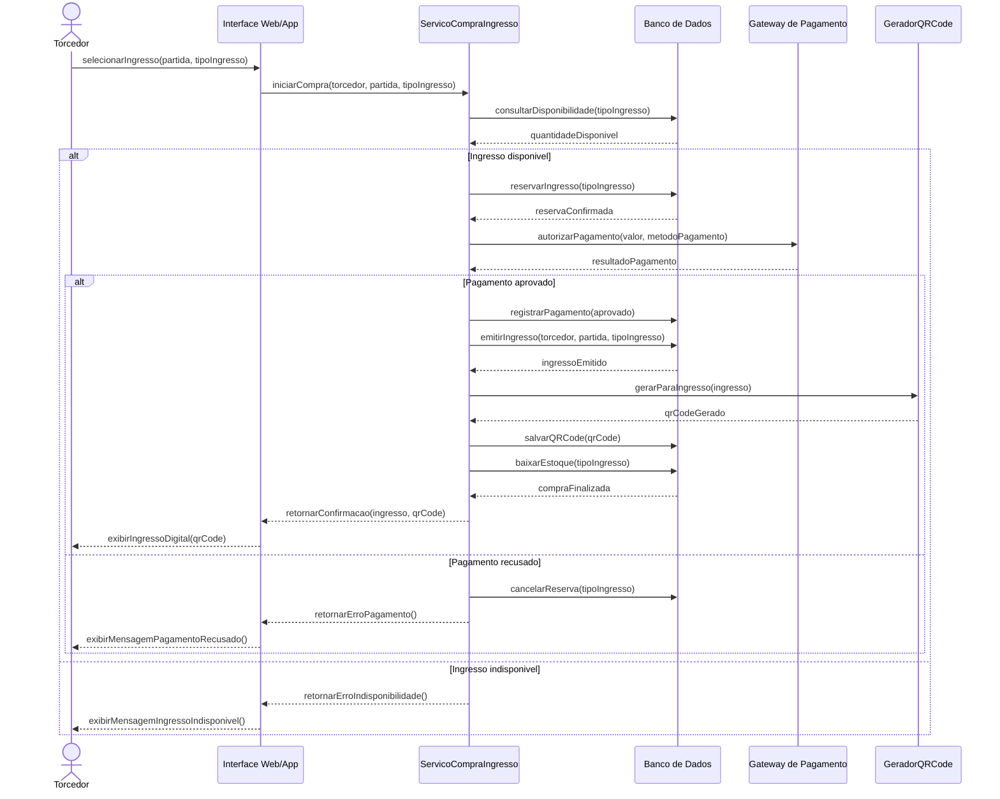

# 03 — Modelagem Comportamental — Fatia 1

## Fatia 1 — Compra de ingresso online com geração de QR Code

### Histórias de usuário cobertas

* **US-SUB1-004** — Como torcedor, eu quero comprar ingressos online, para que eu garanta meu acesso ao evento sem precisar ir ao local antecipadamente.
* **US-SUB1-005** — Como torcedor, eu quero receber confirmação da compra, para que eu tenha segurança de que meu ingresso foi emitido corretamente.
* **US-SUB1-006** — Como torcedor, eu quero acessar meu ingresso digital com QR Code, para que eu consiga entrar no evento de forma prática e segura.
* **US-SUB2-006** — Como administrador do evento, eu quero configurar tipos de ingressos, lotes e preços, para que eu gerencie a estratégia comercial do evento.

---

## 3.1 Justificativa da escolha do diagrama

Para esta fatia foi escolhido o **Diagrama de Sequência**, pois a compra de ingresso envolve a interação entre múltiplos participantes: torcedor, interface da plataforma, serviço de compra, gateway de pagamento, gerador de QR Code e banco de dados.

Esse tipo de diagrama é adequado porque permite visualizar a ordem temporal das mensagens, as chamadas entre componentes e os caminhos alternativos, como pagamento aprovado, pagamento recusado ou falta de ingresso disponível.

---

## 3.2 Diagrama de Sequência

---

## 3.3 Explicação do fluxo

O fluxo começa quando o torcedor seleciona uma partida e um tipo de ingresso. A interface envia a solicitação ao serviço responsável pela compra, que consulta o banco de dados para verificar se ainda existe disponibilidade.

Se houver ingresso disponível, o sistema realiza uma reserva temporária para evitar venda duplicada. Em seguida, o pagamento é enviado ao gateway externo. Caso o pagamento seja aprovado, o sistema registra a transação, emite o ingresso, gera o QR Code e baixa o estoque disponível. Ao final, o ingresso digital é exibido ao torcedor.

Se o pagamento for recusado, a reserva é cancelada e o torcedor recebe uma mensagem informando a falha. Se não houver ingresso disponível, o sistema encerra o fluxo e informa que não há mais ingressos para aquela categoria.

---

## 3.4 Regras de negócio representadas

| Regra     | Descrição                                                                         |
| --------- | --------------------------------------------------------------------------------- |
| RN-F1-001 | A compra só pode continuar se houver ingresso disponível                          |
| RN-F1-002 | O sistema deve reservar temporariamente o ingresso antes de processar o pagamento |
| RN-F1-003 | O ingresso só pode ser emitido após pagamento aprovado                            |
| RN-F1-004 | O QR Code só pode ser gerado para ingresso emitido                                |
| RN-F1-005 | Em caso de pagamento recusado, a reserva deve ser cancelada                       |
| RN-F1-006 | A quantidade disponível deve ser atualizada somente após confirmação da compra    |

---

## 3.5 Classes e entidades envolvidas

| Tipo          | Elementos                                                                                                                   |
| ------------- | --------------------------------------------------------------------------------------------------------------------------- |
| Classes       | `Torcedor`, `ServicoCompraIngresso`, `TipoIngresso`, `Pagamento`, `Ingresso`, `QRCode`, `GeradorQRCode`, `GatewayPagamento` |
| Entidades MER | `torcedor`, `tipo_ingresso`, `pagamento`, `ingresso`, `qr_code`                                                             |
