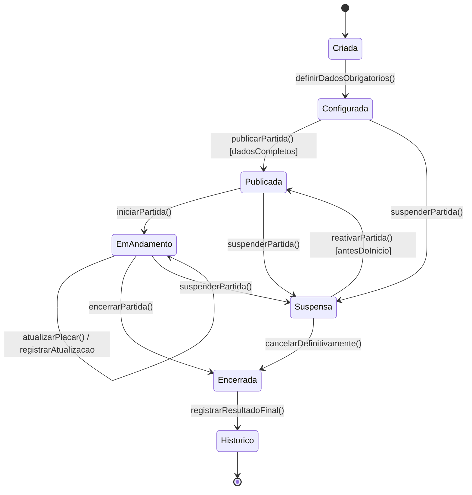

# 03 — Modelagem Comportamental — Fatia 2

## Fatia 2 — Atualização e exibição do placar ao vivo

### Histórias de usuário cobertas

* **US-SUB2-004** — Como administrador do evento, eu quero criar partidas vinculadas a um evento, para que eu organize a programação esportiva disponível ao público.
* **US-SUB2-005** — Como administrador do evento, eu quero definir local, data e horário da partida, para que os torcedores saibam quando e onde ela acontecerá.
* **US-SUB2-007** — Como administrador do evento, eu quero publicar ou suspender uma partida, para que eu controle sua disponibilidade ao público.
* **US-SUB2-009** — Como administrador do evento, eu quero atualizar o placar em tempo real, para que os torcedores recebam o andamento mais recente da partida.
* **US-SUB1-008** — Como torcedor, eu quero acompanhar o placar em tempo real, para que eu fique atualizado durante a partida.

---

## 3.1 Justificativa da escolha do diagrama

Para esta fatia foi escolhido o **Diagrama de Estados**, pois a entidade principal do fluxo é a `Partida`, que possui um ciclo de vida bem definido. A partida passa por estados como criada, configurada, publicada, em andamento, encerrada ou suspensa.

Esse tipo de diagrama é adequado porque permite representar transições disparadas por eventos, como publicação da partida, início do jogo, atualização de placar, encerramento e suspensão. Também deixa claro que algumas ações só são permitidas em determinados estados.

---

## 3.2 Diagrama de Estados da Partida

---

## 3.3 Explicação do ciclo de vida

A partida inicia no estado **Criada**, quando o administrador cria uma nova partida vinculada a um evento. Depois, ela passa para **Configurada** quando recebe os dados obrigatórios, como local, data, horário e participantes.

Quando todos os dados estão completos, a partida pode ser **Publicada**, tornando-se visível para os torcedores. No horário do evento, o administrador pode iniciar a partida, alterando seu estado para **EmAndamento**. Apenas nesse estado o placar pode ser atualizado continuamente.

Durante a partida em andamento, cada atualização de placar gera um registro histórico. Quando o jogo termina, a partida é marcada como **Encerrada** e, depois, enviada para o **Histórico**. A partida também pode ser suspensa em alguns estados, desde que respeitadas as regras da plataforma.

---

## 3.4 Estados da entidade `Partida`

| Estado        | Descrição                                                              |
| ------------- | ---------------------------------------------------------------------- |
| `Criada`      | A partida foi criada, mas ainda não possui todos os dados obrigatórios |
| `Configurada` | A partida possui local, data, horário e participantes definidos        |
| `Publicada`   | A partida está visível para os torcedores                              |
| `EmAndamento` | A partida está ocorrendo e permite atualização de placar               |
| `Suspensa`    | A partida foi suspensa temporariamente ou retirada da exibição         |
| `Encerrada`   | A partida terminou e não permite novas atualizações de placar          |
| `Historico`   | A partida foi arquivada para consulta posterior                        |

---

## 3.5 Regras de negócio representadas

| Regra     | Descrição                                                                         |
| --------- | --------------------------------------------------------------------------------- |
| RN-F2-001 | Uma partida só pode ser publicada se possuir dados obrigatórios preenchidos       |
| RN-F2-002 | Apenas partidas publicadas podem ser iniciadas                                    |
| RN-F2-003 | O placar só pode ser atualizado quando a partida estiver em andamento             |
| RN-F2-004 | Cada atualização de placar deve gerar um registro histórico                       |
| RN-F2-005 | Partidas encerradas não podem ter placar alterado                                 |
| RN-F2-006 | Partidas suspensas não devem ficar disponíveis para acompanhamento público normal |

---

## 3.6 Classes e entidades envolvidas

| Tipo          | Elementos                                                                             |
| ------------- | ------------------------------------------------------------------------------------- |
| Classes       | `AdministradorEvento`, `Evento`, `Partida`, `Placar`, `AtualizacaoPlacar`, `Torcedor` |
| Entidades MER | `administrador_evento`, `evento`, `partida`, `placar`, `atualizacao_placar`           |
