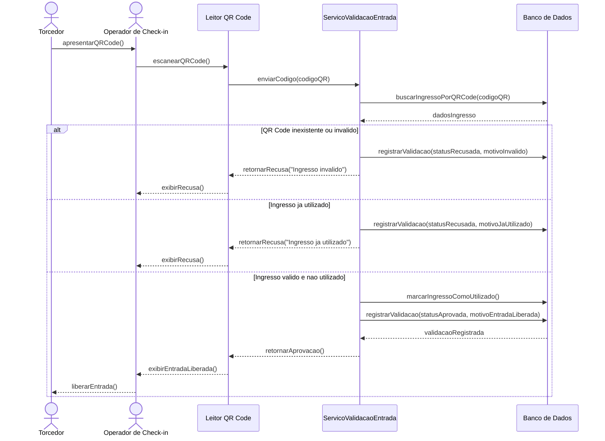

# 03 — Modelagem Comportamental — Fatia 3

## Fatia 3 — Validação de ingresso no check-in com bloqueio de reutilização

### Histórias de usuário cobertas

* **US-SUB3-001** — Como operador de check-in, eu quero validar o ingresso por QR Code, para que eu autorize a entrada apenas de ingressos válidos.
* **US-SUB3-002** — Como operador de check-in, eu quero bloquear reutilização do mesmo ingresso, para que não ocorram acessos duplicados ao evento.
* **US-SUB3-004** — Como operador de check-in, eu quero registrar horário e status da entrada do torcedor, para que haja rastreabilidade operacional do acesso.
* **US-SUB1-006** — Como torcedor, eu quero acessar meu ingresso digital com QR Code, para que eu consiga entrar no evento de forma prática e segura.

---

## 3.1 Justificativa da escolha do diagrama

Para esta fatia foi escolhido o **Diagrama de Sequência**, pois o fluxo de check-in envolve interação direta entre torcedor, operador, sistema de validação, banco de dados e entidade de ingresso.

Esse diagrama permite representar claramente a ordem das verificações: leitura do QR Code, consulta do ingresso, verificação de validade, bloqueio de reutilização e registro da validação. Também permite representar caminhos alternativos, como ingresso válido, ingresso já utilizado ou QR Code inválido.

---

## 3.2 Diagrama de Sequência

---

## 3.3 Explicação do fluxo

O fluxo começa quando o torcedor apresenta o QR Code do ingresso digital ao operador de check-in. O operador utiliza o leitor para escanear o código e enviar a informação ao serviço de validação.

O sistema consulta o banco de dados para verificar se o QR Code existe e se está associado a um ingresso válido. Caso o código seja inválido, a entrada é recusada e a tentativa fica registrada. Caso o ingresso já tenha sido utilizado, o sistema também recusa a entrada e registra o motivo.

Se o ingresso for válido e ainda não tiver sido utilizado, o sistema marca o ingresso como utilizado, registra a validação aprovada e informa ao operador que a entrada pode ser liberada. Essa mudança de estado impede que o mesmo ingresso seja usado novamente.

---

## 3.4 Regras de negócio representadas

| Regra     | Descrição                                                                             |
| --------- | ------------------------------------------------------------------------------------- |
| RN-F3-001 | Todo QR Code escaneado deve ser consultado no sistema                                 |
| RN-F3-002 | QR Code inexistente ou inválido deve resultar em entrada recusada                     |
| RN-F3-003 | Ingresso já utilizado não pode ser aprovado novamente                                 |
| RN-F3-004 | Ingresso válido e não utilizado deve ser marcado como utilizado no momento da entrada |
| RN-F3-005 | Toda tentativa de validação deve ser registrada                                       |
| RN-F3-006 | A validação deve registrar operador, horário, status e mensagem                       |

---

## 3.5 Classes e entidades envolvidas

| Tipo          | Elementos                                                               |
| ------------- | ----------------------------------------------------------------------- |
| Classes       | `OperadorCheckin`, `Ingresso`, `QRCode`, `ValidacaoEntrada`, `Torcedor` |
| Entidades MER | `operador_checkin`, `ingresso`, `qr_code`, `validacao_entrada`          |
